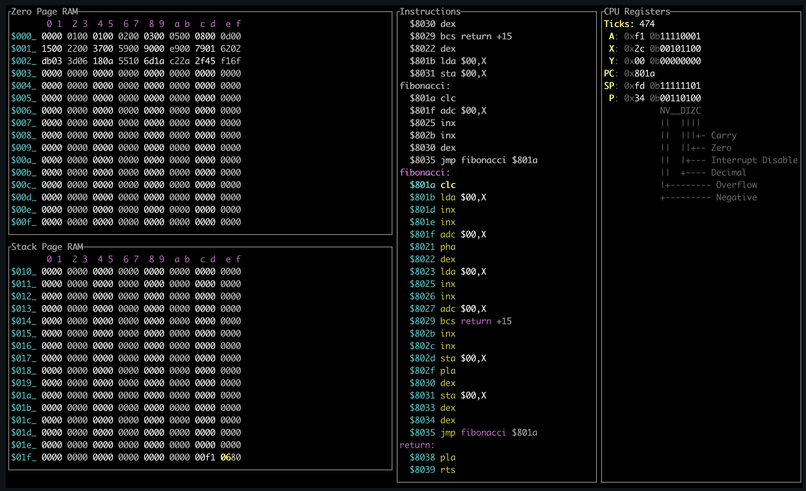

# 6502 Emulator in Rust

This is a 6502 emulator, debugger, and visualizer built in Rust. It features an ASM compiler, which takes in an .asm file, and can either output the binary machine code, or load it directly in memory and run it. This project started as an NES emulator, but I decided I was having more fun just building the CPU emulator, and stopped there. I spent more time on compiler and debugger, as I found that interesting.



## How to run

The CPU debugger and visualizer can visualize the CPU running, and let you step through the code.

See all of the [asm examples](src/bin/cpu-visualizer/asm).

```
tree src/bin/cpu-visualizer/asm

src/bin/cpu-visualizer/asm
├── add-with-carry.asm
├── addressing-modes.asm
├── branching.asm
├── compare.asm
├── fibonacci-u16.asm
├── fibonacci-u8.asm
├── fill-zero-page.asm
├── labels-with-jumps.asm
├── logical-operators.asm
├── register-a-modes.asm
├── stack.asm
└── status-flags.asm
```

Run the `cpu-visualizer` binary with a path to the `.asm` file.

```
cargo run --bin cpu-visualizer src/bin/cpu-visualizer/asm/fill-zero-page.asm
```

The shortcuts for the program can be viewed by hitting `?` while using the program.

```
┌Help─────────────────────────────────────┐
│   n - next instruction                  │
│ 1-9 - next instructions exponentionally │
│ h/? - show help                         │
│   q - quit                              │
│   a - add a page of memory              │
│   r - remove a page of memory           │
└─────────────────────────────────────────┘
```

To view the logs of the visualizer append the following:

```
2> error.log; clear; cat error.log
```

## Simple Game

I also built a simple game visualizer which can run the snake game from the [Easy 6502 tutorial](https://skilldrick.github.io/easy6502/).

```
cargo run --bin simple-game src/bin/simple-game/asm/snake.asm
```
